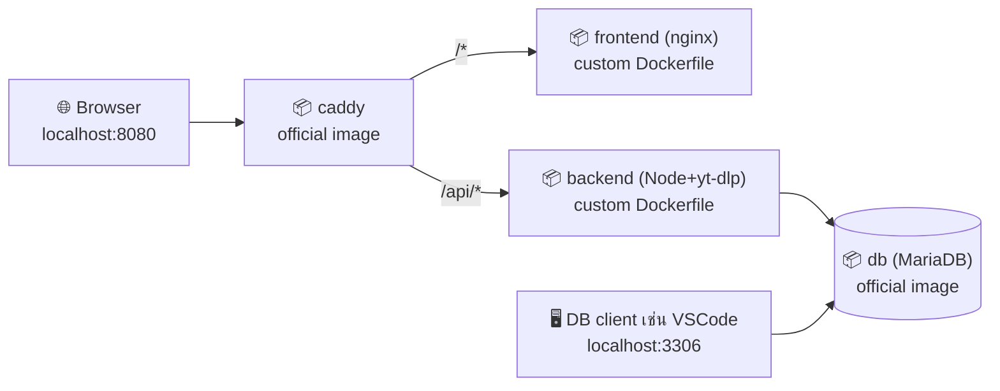

# qr-video-toolkit

เว็บแปลง URL เป็น QR Code + ดาวน์โหลดวิดีโอ (เลือกได้ว่าจะเอาวิดีโอเต็มหรือ
เสียงอย่างเดียว) ทำเป็นโปรเจกต์เดี่ยวสำหรับสาธิต Docker Compose

> **หมายเหตุการใช้งาน:** ฟีเจอร์ดาวน์โหลดวิดีโอมีไว้เพื่อการศึกษา
> Docker/Node.js เท่านั้น ใช้ดาวน์โหลดเฉพาะเนื้อหาที่ตัวเองมีสิทธิ์ (คลิปของ
> ตัวเอง, Creative Commons ฯลฯ) และเคารพ Terms of Service ของเว็บไซต์ต้นทาง

## System Diagram

ดูฉบับเต็ม (พร้อม sequence diagram) ที่ [`docs/system-diagram.md`](docs/system-diagram.md)



## โครงสร้างโปรเจกต์

```
qr-video-toolkit/
├── docker-compose.yml
├── .env.example
├── caddy/Caddyfile          ← reverse proxy config
├── docs/system-diagram.md   ← Mermaid diagram ฉบับเต็ม
├── frontend/                ← static HTML/CSS/JS (Dockerfile ของตัวเอง)
│   ├── Dockerfile
│   └── public/
└── backend/                 ← Node.js/Express + yt-dlp + ffmpeg (Dockerfile ของตัวเอง)
    ├── Dockerfile
    ├── package.json
    └── src/
```

## วิธีรัน

```bash
cp .env.example .env
# แก้รหัสผ่านใน .env เป็นของตัวเอง

# build ทุก image ใหม่ทั้งหมดแบบไม่ใช้ cache (ให้เห็นทุก layer ตอนอัดคลิป)
docker compose build --no-cache

docker compose up -d
docker compose logs -f

open http://localhost:8080
```

หยุด/ล้างทุกอย่าง (รวม volume ข้อมูล):

```bash
docker compose down -v
```

## API โดยสังเขป

| Method | Path | หมายเหตุ |
|---|---|---|
| POST | `/api/qr` | `{url}` → สร้าง QR code, บันทึกลง MariaDB |
| GET | `/api/qr/file/:fileName` | เสิร์ฟไฟล์ QR ที่สร้างไว้ |
| GET | `/api/qr/history` | ประวัติ QR ที่สร้างล่าสุด 20 รายการ |
| POST | `/api/download` | `{url, format:"video"\|"audio"}` → เรียก yt-dlp |
| GET | `/api/download/file/:fileName` | ดาวน์โหลดไฟล์ผลลัพธ์ |
| GET | `/api/download/history` | ประวัติการดาวน์โหลดล่าสุด 20 รายการ |
