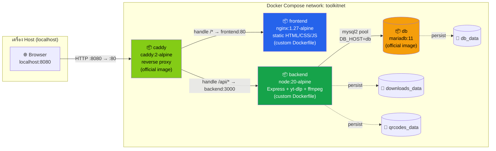
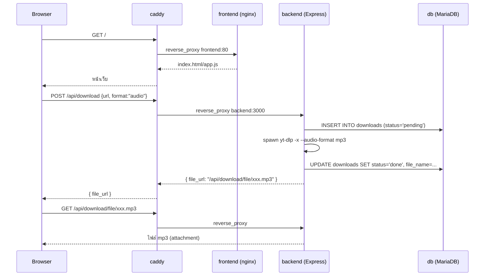

# System Diagram — qr-video-toolkit

## Container / Network Diagram

## Sequence Diagram — ดาวน์โหลดวิดีโอ (เลือกเอาเสียงอย่างเดียว)

## เหตุผลของสถาปัตยกรรม (สรุปสั้น)

- **caddy เป็นจุดเข้าเดียวของ traffic ในแอป** — publish port ออก host แค่
  container เดียว (`8080:80`) ส่วน `frontend`/`backend` ไม่เปิด port ออก
  host เลย ลด attack surface และทำให้ browser เห็นแค่ origin เดียว ไม่ต้อง
  ยุ่งกับ CORS (`db` เปิด `3306` ออก host เพิ่มเป็นข้อยกเว้นเดียว เพื่อให้ต่อ
  จาก DB client บนเครื่อง เช่น VSCode ได้ตรงๆ)
- **backend ↔ db ผ่าน internal network + user แยกจาก root** — `db` ใช้
  `MARIADB_USER`/`MARIADB_PASSWORD` แทนการต่อด้วย root ตรงๆ ตามหลัก
  least-privilege
- **`depends_on` + `healthcheck`** — `backend` รอจน MariaDB พร้อมรับ
  connection จริงก่อนค่อย start กัน race condition ตอน container ทั้งชุด
  ขึ้นพร้อมกันครั้งแรก
- **named volumes แยก 3 ก้อน** (`db_data`, `downloads_data`, `qrcodes_data`)
  — rebuild image ไม่ทำให้ข้อมูล/ไฟล์เดิมหาย
